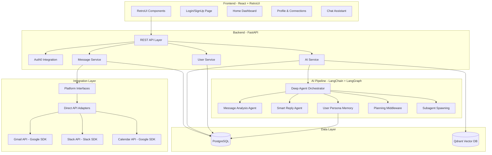

# Design Document

## Overview

Champa is a full-stack intelligent unified inbox system that consolidates communications from Gmail, Slack, and Calendar into a single interface with AI-powered analysis and response generation. The architecture follows a clean separation between frontend (React + RetroUI), backend (FastAPI), integration layer (Composio with interface abstraction), AI processing (LangChain + LangGraph deep agents), and data persistence (PostgreSQL + Qdrant).

The system operates in a continuous cycle: fetch messages from platforms → normalize to unified format → analyze with AI pipeline → store in databases → present in unified UI → enable user interactions including smart reply generation with human-in-the-loop approval.

## Architecture

### High-Level Architecture



### Technology Stack

**Frontend:**
- React 18+ with TypeScript
- RetroUI component library
- React Router for navigation
- Axios for API calls
- WebSocket for real-time updates

**Backend:**
- FastAPI (Python 3.11+)
- Auth0 for authentication
- Pydantic for data validation
- SQLAlchemy for ORM
- Alembic for migrations

**Integration:**
- Direct OAuth 2.0 flows with official platform SDKs
- Google API Client for Gmail and Calendar
- Slack SDK for Slack integration
- Abstract interfaces for platform independence

**AI/ML:**
- LangChain for LLM orchestration
- LangGraph for agent workflows
- Deep Agents for complex task handling
- OpenAI GPT-4 (or configurable LLM)
- Sentence Transformers for embeddings

**Data:**
- PostgreSQL 15+ for relational data
- Qdrant for vector storage and semantic search

## Components and Interfaces

### Frontend Components

#### 1. Authentication Module
- **LoginPage**: Auth0 integration with username/password fallback
- **SignUpPage**: User registration with Auth0
- **AuthContext**: React context for auth state management
- **ProtectedRoute**: Route wrapper for authenticated access

#### 2. Home Dashboard
- **StatsCard**: Display message counts and actionables
- **MessageFeed**: Unified message list with filtering
- **MessageCard**: Individual message display with summary, priority, source
- **ActionableList**: Tasks and deadlines extracted from messages
- **DraftApprovalQueue**: Pending smart reply drafts

#### 3. Profile Page
- **UserProfile**: Display and edit user information
- **PlatformConnections**: List of available platforms
- **ConnectionCard**: Individual platform with connect/disconnect actions
- **OAuthFlow**: Handle OAuth redirect and token exchange

#### 4. Chat Assistant
- **ChatInterface**: Full-page chat UI
- **MessageBubble**: Individual chat messages
- **InputBar**: Message composition with send button
- **TypingIndicator**: Show when agent is processing

### Backend Services

#### 1. Authentication Service
```python
class AuthService:
    def authenticate_user(username: str, password: str) -> TokenResponse
    def verify_token(token: str) -> User
    def refresh_token(refresh_token: str) -> TokenResponse
    def logout(token: str) -> None
```

#### 2. Platform Integration Service
```python
class PlatformInterface(ABC):
    @abstractmethod
    def connect(user_id: str, oauth_code: str) -> Connection
    
    @abstractmethod
    def disconnect(user_id: str) -> None
    
    @abstractmethod
    def fetch_messages(user_id: str, since: datetime) -> List[RawMessage]
    
    @abstractmethod
    def send_message(user_id: str, message: OutgoingMessage) -> MessageResult

class GoogleGmailAdapter(PlatformInterface):
    # Direct Gmail API implementation using Google SDK
    
class SlackAdapter(PlatformInterface):
    # Direct Slack API implementation using Slack SDK
    
class GoogleCalendarAdapter(PlatformInterface):
    # Direct Calendar API implementation using Google SDK
```

#### 3. Message Service
```python
class MessageService:
    def fetch_new_messages(user_id: str) -> List[NormalizedMessage]
    def normalize_message(raw_message: RawMessage) -> NormalizedMessage
    def store_message(message: NormalizedMessage) -> str
    def get_messages(user_id: str, filters: MessageFilters) -> List[NormalizedMessage]
    def get_thread_context(message_id: str) -> ThreadContext
```

#### 4. AI Service
```python
class AIService:
    def analyze_message(message: NormalizedMessage) -> MessageAnalysis
    def generate_smart_reply(message_id: str, user_id: str) -> SmartReply
    def process_chat_query(user_id: str, query: str) -> ChatResponse
    def update_user_persona(user_id: str, interaction: Interaction) -> None
```

### AI Pipeline Components

#### 1. Deep Agent Orchestrator
Built using LangGraph's `create_deep_agent`, provides:
- **Planning Middleware**: Break complex tasks into steps
- **Filesystem Middleware**: Store context and memories
- **Subagent Middleware**: Spawn specialized agents

#### 2. Message Analysis Agent
```python
class MessageAnalysisAgent:
    def summarize(message: NormalizedMessage) -> str
    def classify_intent(message: NormalizedMessage) -> Intent
    def extract_tasks(message: NormalizedMessage) -> List[Task]
    def detect_deadlines(message: NormalizedMessage) -> List[Deadline]
    def calculate_priority(message: NormalizedMessage, context: UserContext) -> float
```

#### 3. Smart Reply Generator Agent
```python
class SmartReplyAgent:
    def fetch_thread(message_id: str) -> ThreadContext
    def retrieve_persona(user_id: str) -> UserPersona
    def create_plan(thread: ThreadContext, persona: UserPersona) -> ReplyPlan
    def generate_draft(plan: ReplyPlan) -> str
    def format_for_platform(draft: str, platform: Platform) -> str
```

#### 4. User Persona Memory
Uses LangGraph Store for long-term memory:
```python
class PersonaStore:
    def store_observation(user_id: str, observation: Observation) -> None
    def retrieve_style_patterns(user_id: str) -> StylePatterns
    def retrieve_contacts(user_id: str) -> List[Contact]
    def retrieve_preferences(user_id: str) -> Preferences
    def search_memories(user_id: str, query: str) -> List[Memory]
```

## Data Models

### PostgreSQL Schema

#### Users Table
```sql
CREATE TABLE users (
    id UUID PRIMARY KEY DEFAULT gen_random_uuid(),
    auth0_id VARCHAR(255) UNIQUE NOT NULL,
    email VARCHAR(255) UNIQUE NOT NULL,
    username VARCHAR(100),
    created_at TIMESTAMP DEFAULT CURRENT_TIMESTAMP,
    updated_at TIMESTAMP DEFAULT CURRENT_TIMESTAMP
);
```

#### Platform Connections Table
```sql
CREATE TABLE platform_connections (
    id UUID PRIMARY KEY DEFAULT gen_random_uuid(),
    user_id UUID REFERENCES users(id) ON DELETE CASCADE,
    platform VARCHAR(50) NOT NULL, -- 'gmail', 'slack', 'calendar'
    access_token TEXT NOT NULL,
    refresh_token TEXT,
    token_expires_at TIMESTAMP,
    connected_at TIMESTAMP DEFAULT CURRENT_TIMESTAMP,
    last_sync_at TIMESTAMP,
    UNIQUE(user_id, platform)
);
```

#### Messages Table
```sql
CREATE TABLE messages (
    id UUID PRIMARY KEY DEFAULT gen_random_uuid(),
    user_id UUID REFERENCES users(id) ON DELETE CASCADE,
    platform VARCHAR(50) NOT NULL,
    platform_message_id VARCHAR(255) NOT NULL,
    sender VARCHAR(255) NOT NULL,
    content TEXT NOT NULL,
    subject VARCHAR(500),
    timestamp TIMESTAMP NOT NULL,
    thread_id VARCHAR(255),
    metadata JSONB, -- Platform-specific data
    created_at TIMESTAMP DEFAULT CURRENT_TIMESTAMP,
    UNIQUE(user_id, platform, platform_message_id)
);

CREATE INDEX idx_messages_user_timestamp ON messages(user_id, timestamp DESC);
CREATE INDEX idx_messages_thread ON messages(thread_id);
```

#### Message Analysis Table
```sql
CREATE TABLE message_analysis (
    id UUID PRIMARY KEY DEFAULT gen_random_uuid(),
    message_id UUID REFERENCES messages(id) ON DELETE CASCADE,
    summary TEXT NOT NULL,
    intent VARCHAR(100),
    priority_score FLOAT NOT NULL,
    analyzed_at TIMESTAMP DEFAULT CURRENT_TIMESTAMP,
    UNIQUE(message_id)
);
```

#### Actionable Items Table
```sql
CREATE TABLE actionable_items (
    id UUID PRIMARY KEY DEFAULT gen_random_uuid(),
    message_id UUID REFERENCES messages(id) ON DELETE CASCADE,
    user_id UUID REFERENCES users(id) ON DELETE CASCADE,
    type VARCHAR(50) NOT NULL, -- 'task', 'deadline', 'meeting'
    description TEXT NOT NULL,
    deadline TIMESTAMP,
    completed BOOLEAN DEFAULT FALSE,
    created_at TIMESTAMP DEFAULT CURRENT_TIMESTAMP
);

CREATE INDEX idx_actionables_user_deadline ON actionable_items(user_id, deadline);
```

#### Smart Replies Table
```sql
CREATE TABLE smart_replies (
    id UUID PRIMARY KEY DEFAULT gen_random_uuid(),
    message_id UUID REFERENCES messages(id) ON DELETE CASCADE,
    user_id UUID REFERENCES users(id) ON DELETE CASCADE,
    draft_content TEXT NOT NULL,
    status VARCHAR(50) NOT NULL, -- 'pending', 'approved', 'rejected', 'sent'
    created_at TIMESTAMP DEFAULT CURRENT_TIMESTAMP,
    reviewed_at TIMESTAMP,
    sent_at TIMESTAMP
);
```

#### User Persona Table
```sql
CREATE TABLE user_persona (
    id UUID PRIMARY KEY DEFAULT gen_random_uuid(),
    user_id UUID REFERENCES users(id) ON DELETE CASCADE,
    memory_key VARCHAR(255) NOT NULL,
    memory_value JSONB NOT NULL,
    created_at TIMESTAMP DEFAULT CURRENT_TIMESTAMP,
    updated_at TIMESTAMP DEFAULT CURRENT_TIMESTAMP,
    UNIQUE(user_id, memory_key)
);
```

### Qdrant Collections

#### Message Embeddings Collection
```python
{
    "collection_name": "message_embeddings",
    "vectors": {
        "size": 1536,  # OpenAI text-embedding-3-small
        "distance": "Cosine"
    },
    "payload_schema": {
        "message_id": "string",
        "user_id": "string",
        "platform": "string",
        "timestamp": "integer",
        "content_preview": "string"
    }
}
```

### Pydantic Models

#### NormalizedMessage
```python
class NormalizedMessage(BaseModel):
    id: Optional[str] = None
    user_id: str
    platform: Literal["gmail", "slack", "calendar"]
    platform_message_id: str
    sender: str
    content: str
    subject: Optional[str] = None
    timestamp: datetime
    thread_id: Optional[str] = None
    metadata: Dict[str, Any] = {}
```

#### MessageAnalysis
```python
class MessageAnalysis(BaseModel):
    message_id: str
    summary: str
    intent: str
    priority_score: float
    tasks: List[Task] = []
    deadlines: List[Deadline] = []
```

#### SmartReply
```python
class SmartReply(BaseModel):
    id: Optional[str] = None
    message_id: str
    user_id: str
    draft_content: str
    status: Literal["pending", "approved", "rejected", "sent"]
    created_at: datetime
```


## Correctness Properties

*A property is a characteristic or behavior that should hold true across all valid executions of a system-essentially, a formal statement about what the system should do. Properties serve as the bridge between human-readable specifications and machine-verifiable correctness guarantees.*

### Property 1: Valid credentials create sessions
*For any* valid username and password combination, authenticating should result in a session token being created and returned to the user.
**Validates: Requirements 1.2**

### Property 2: Invalid credentials are rejected
*For any* invalid credential combination (wrong password, non-existent user, malformed input), authentication should fail and return an error without creating a session.
**Validates: Requirements 1.3**

### Property 3: Protected routes require valid tokens
*For any* protected route and any request, access should only be granted if a valid session token is provided in the request headers.
**Validates: Requirements 1.4**

### Property 4: Logout invalidates sessions
*For any* active session, logging out should invalidate the session token such that subsequent requests with that token are rejected.
**Validates: Requirements 1.5**

### Property 5: OAuth success stores credentials
*For any* successful OAuth flow, the system should store the access token, refresh token, and expiration time in the database and mark the platform as connected.
**Validates: Requirements 2.3**

### Property 6: Disconnect removes credentials
*For any* connected platform, disconnecting should remove all stored tokens from the database and mark the platform as disconnected.
**Validates: Requirements 2.4**

### Property 7: Connection failures show errors
*For any* platform connection attempt that fails, the system should display an error message to the user without storing partial credentials.
**Validates: Requirements 2.5**

### Property 8: Message detection triggers fetch
*For any* new message detected on a connected platform, the system should fetch the complete message content including all required metadata fields.
**Validates: Requirements 3.2**

### Property 9: Gmail fetch includes required fields
*For any* email fetched from Gmail, the result should include subject, body, sender, recipients, and timestamp fields.
**Validates: Requirements 3.3**

### Property 10: Slack fetch includes required fields
*For any* message fetched from Slack, the result should include message text, channel, sender, and timestamp fields.
**Validates: Requirements 3.4**

### Property 11: Calendar fetch includes required fields
*For any* event fetched from Calendar, the result should include title, description, participants, start time, and end time fields.
**Validates: Requirements 3.5**

### Property 12: All messages are normalized
*For any* message fetched from any platform, the system should convert it to the normalized message format before further processing.
**Validates: Requirements 4.1**

### Property 13: Normalization preserves platform identifier
*For any* message being normalized, the source platform identifier should be preserved in the normalized message.
**Validates: Requirements 4.2**

### Property 14: Normalization extracts common fields
*For any* message being normalized, the result should contain sender, content, timestamp, and unique identifier fields.
**Validates: Requirements 4.3**

### Property 15: Normalization preserves metadata
*For any* message with platform-specific metadata, the normalized message should contain that metadata in a structured format.
**Validates: Requirements 4.4**

### Property 16: Normalized messages are validated
*For any* normalized message, the system should validate the format against the schema before allowing storage.
**Validates: Requirements 4.5**

### Property 17: Stored messages trigger AI analysis
*For any* normalized message stored in the database, the system should pass it through the AI Pipeline for analysis.
**Validates: Requirements 5.1**

### Property 18: AI analysis generates summaries
*For any* message processed by the AI Pipeline, the result should include a summary field with non-empty content.
**Validates: Requirements 5.2**

### Property 19: AI analysis classifies intent
*For any* message processed by the AI Pipeline, the result should include an intent classification.
**Validates: Requirements 5.3**

### Property 20: AI analysis extracts actionables
*For any* message containing tasks or deadlines, the AI Pipeline should extract them and store them as actionable items.
**Validates: Requirements 5.4**

### Property 21: AI analysis assigns priority
*For any* message processed by the AI Pipeline, the result should include a priority score between 0.0 and 1.0.
**Validates: Requirements 5.5**

### Property 22: Interactions update persona
*For any* user interaction with the system, the Deep Agent should store relevant observations in the User Persona.
**Validates: Requirements 6.1**

### Property 23: Persona captures style patterns
*For any* User Persona being updated, the system should capture and store communication style patterns.
**Validates: Requirements 6.2**

### Property 24: Persona identifies contacts
*For any* User Persona with multiple interactions, the system should identify and store recurring contacts and their relationships.
**Validates: Requirements 6.3**

### Property 25: Persona records preferences
*For any* User Persona being updated, the system should record user preferences for message handling.
**Validates: Requirements 6.4**

### Property 26: Reply generation retrieves persona
*For any* response being generated, the Deep Agent should retrieve relevant User Persona data to inform the output.
**Validates: Requirements 6.5**

### Property 27: Smart reply fetches thread context
*For any* smart reply request, the system should fetch the complete thread context including all related messages.
**Validates: Requirements 7.1**

### Property 28: Smart reply uses persona data
*For any* smart reply being generated, the Deep Agent should retrieve and use relevant User Persona data.
**Validates: Requirements 7.2**

### Property 29: Smart reply produces draft
*For any* smart reply request, the system should produce a draft response that references context from the original message.
**Validates: Requirements 7.4**

### Property 30: Smart reply requires approval
*For any* smart reply generated, the system should mark it as pending approval and not send it until the user approves.
**Validates: Requirements 7.5**

### Property 31: Approved drafts are sent
*For any* smart reply marked as approved, the system should send the email via the connected Gmail account and mark it as sent.
**Validates: Requirements 8.3**

### Property 32: Edited drafts are re-presented
*For any* smart reply that is edited, the system should update the content and present it again for final approval.
**Validates: Requirements 8.4**

### Property 33: Rejected drafts are discarded
*For any* smart reply marked as rejected, the system should discard it and allow the user to request a new draft.
**Validates: Requirements 8.5**

### Property 34: Messages show platform indicator
*For any* message displayed in the feed, the UI should show the source platform indicator.
**Validates: Requirements 9.2**

### Property 35: Messages show AI summary
*For any* message displayed in the feed, the UI should show the AI-generated summary.
**Validates: Requirements 9.3**

### Property 36: Messages show priority
*For any* message displayed in the feed, the UI should show the priority level.
**Validates: Requirements 9.4**

### Property 37: Messages show actionables
*For any* message with extracted actionable items, the UI should display them with deadline indicators.
**Validates: Requirements 9.5**

### Property 38: Statistics show draft count
*For any* home page view, the statistics should display the accurate count of pending draft approvals.
**Validates: Requirements 10.2**

### Property 39: Statistics show today's actionables
*For any* home page view, the statistics should display the accurate count of actionable items with deadlines today.
**Validates: Requirements 10.3**

### Property 40: Statistic clicks filter feed
*For any* statistic clicked by the user, the message feed should filter to show only relevant items.
**Validates: Requirements 10.5**

### Property 41: Chat queries are processed
*For any* message sent to the assistant, the Deep Agent should process it using the AI Pipeline.
**Validates: Requirements 11.2**

### Property 42: Chat queries access data
*For any* query being processed, the Deep Agent should access message history and User Persona data.
**Validates: Requirements 11.3**

### Property 43: Chat responses are displayed
*For any* assistant response, the system should display it in the chat interface.
**Validates: Requirements 11.4**

### Property 44: Chat actions are executed
*For any* action requested by the user, the Deep Agent should execute it and confirm completion.
**Validates: Requirements 11.5**

### Property 45: Messages are stored in PostgreSQL
*For any* normalized message created, the system should store it in the PostgreSQL database.
**Validates: Requirements 12.1**

### Property 46: Storage includes all fields
*For any* message being stored, the database record should include all normalized fields and platform-specific metadata.
**Validates: Requirements 12.2**

### Property 47: Thread relationships are maintained
*For any* messages in the same thread, the system should maintain the relationships between them in the database.
**Validates: Requirements 12.3**

### Property 48: Interactions are recorded
*For any* user interaction with a message, the system should record the action taken in the database.
**Validates: Requirements 12.4**

### Property 49: Messages generate embeddings
*For any* message analyzed by the AI Pipeline, the system should generate embeddings for the content.
**Validates: Requirements 13.1**

### Property 50: Embeddings are stored in Qdrant
*For any* embedding generated, the system should store it in the Qdrant vector database.
**Validates: Requirements 13.2**

### Property 51: Embeddings link to messages
*For any* embedding stored in Qdrant, it should be associated with the corresponding message identifier.
**Validates: Requirements 13.3**

### Property 52: Semantic search queries Qdrant
*For any* semantic search request, the system should query Qdrant using query embeddings.
**Validates: Requirements 13.4**

### Property 53: Search results retrieve full messages
*For any* semantic search results returned from Qdrant, the system should retrieve the full message data from PostgreSQL.
**Validates: Requirements 13.5**

### Property 54: Platform calls use abstraction
*For any* platform interface call, the system should route through the abstraction layer rather than calling Composio directly.
**Validates: Requirements 14.3**

### Property 55: API failures trigger retries
*For any* platform API call that fails, the system should retry with exponential backoff before giving up.
**Validates: Requirements 16.1**

### Property 56: Exhausted retries log and notify
*For any* API call where retries are exhausted, the system should log the error and notify the user.
**Validates: Requirements 16.2**

### Property 57: AI errors trigger fallback
*For any* AI Pipeline error, the system should fall back to basic processing without AI enhancements.
**Validates: Requirements 16.3**

### Property 58: Database failures rollback
*For any* database operation that fails, the system should roll back the transaction and preserve data consistency.
**Validates: Requirements 16.4**

### Property 59: Token expiration prompts re-auth
*For any* OAuth token that expires, the system should prompt the user to re-authenticate.
**Validates: Requirements 16.5**

## Error Handling

### Platform Integration Errors
- **OAuth Failures**: Display user-friendly error messages with troubleshooting steps
- **API Rate Limits**: Implement exponential backoff and queue requests
- **Network Timeouts**: Retry with increasing delays, max 3 attempts
- **Token Expiration**: Detect expired tokens and trigger re-authentication flow

### AI Pipeline Errors
- **Model Unavailable**: Fall back to basic text processing without AI enhancements
- **Context Length Exceeded**: Truncate message content intelligently, preserving key information
- **Generation Failures**: Log error, notify user, allow manual retry
- **Embedding Failures**: Store message without embeddings, flag for retry

### Database Errors
- **Connection Failures**: Implement connection pooling with automatic reconnection
- **Transaction Failures**: Roll back all changes, preserve data consistency
- **Constraint Violations**: Return validation errors to user with clear messages
- **Query Timeouts**: Optimize queries, implement pagination for large result sets

### User Input Errors
- **Invalid Credentials**: Clear error messages without revealing security details
- **Malformed Requests**: Validate input with Pydantic, return structured error responses
- **Missing Required Fields**: Highlight missing fields in UI before submission
- **File Upload Errors**: Validate file types and sizes, provide clear feedback

## Testing Strategy

### Unit Testing
We will use **pytest** for Python backend testing and **Jest** with **React Testing Library** for frontend testing.

**Backend Unit Tests:**
- Test individual service methods in isolation
- Mock external dependencies (Composio, LLM APIs, databases)
- Test data validation with Pydantic models
- Test error handling and edge cases
- Test database operations with in-memory SQLite

**Frontend Unit Tests:**
- Test component rendering with various props
- Test user interactions (clicks, form submissions)
- Test state management and context
- Mock API calls with MSW (Mock Service Worker)
- Test routing and navigation

### Property-Based Testing
We will use **Hypothesis** for Python property-based testing.

**Configuration:**
- Each property test should run a minimum of 100 iterations
- Use custom strategies for domain-specific data generation
- Tag each test with the correctness property it validates using the format: `# Feature: champa-unified-inbox, Property {number}: {property_text}`

**Key Property Tests:**
- **Authentication Properties**: Generate random valid/invalid credentials, verify session handling
- **Message Normalization Properties**: Generate messages from different platforms, verify normalization preserves required fields
- **AI Analysis Properties**: Generate various message types, verify analysis produces required outputs
- **Database Properties**: Generate random data, verify storage and retrieval consistency
- **Error Handling Properties**: Generate failure scenarios, verify graceful degradation

### Integration Testing
- Test complete workflows end-to-end (fetch → normalize → analyze → store → display)
- Test OAuth flows with mock OAuth providers
- Test AI Pipeline with mock LLM responses
- Test database transactions with real PostgreSQL (test database)
- Test API endpoints with FastAPI TestClient

### Manual Testing
- Test OAuth flows with real Gmail, Slack, Calendar accounts
- Test UI responsiveness and RetroUI component integration
- Test real-time updates and WebSocket connections
- Test human-in-the-loop approval workflows
- Test error scenarios with real platform APIs

## Deployment Considerations

### Environment Configuration
- **Development**: Local PostgreSQL, local Qdrant, OAuth test credentials
- **Staging**: Cloud PostgreSQL, cloud Qdrant, OAuth test accounts
- **Production**: Managed PostgreSQL (RDS/Cloud SQL), managed Qdrant, production OAuth apps

### Secrets Management
- Store Auth0 credentials in environment variables
- Store Google OAuth credentials in secure vault (AWS Secrets Manager, GCP Secret Manager)
- Store Slack OAuth credentials in secure vault
- Store database credentials in secure vault
- Store LLM API keys in secure vault
- Never commit secrets to version control

### Monitoring and Observability
- Log all API calls with request/response times
- Monitor AI Pipeline performance and costs
- Track message processing latency
- Monitor database query performance
- Set up alerts for error rates and system health

### Scalability Considerations
- Implement message processing queue for high volume
- Use database connection pooling
- Cache frequently accessed data (user personas, platform connections)
- Implement rate limiting on API endpoints
- Consider horizontal scaling for backend services

## Future Enhancements

### Additional Platforms
- Discord integration
- SMS integration
- Microsoft Teams integration
- Twitter/X DMs integration

### Advanced AI Features
- Multi-language support for messages
- Sentiment analysis for priority scoring
- Automatic categorization and tagging
- Smart scheduling suggestions based on calendar and email patterns

### Collaboration Features
- Shared inboxes for teams
- Delegation of messages to team members
- Collaborative draft editing
- Team analytics and insights

### Mobile Support
- React Native mobile app
- Push notifications for high-priority messages
- Offline mode with sync when online
- Mobile-optimized UI
